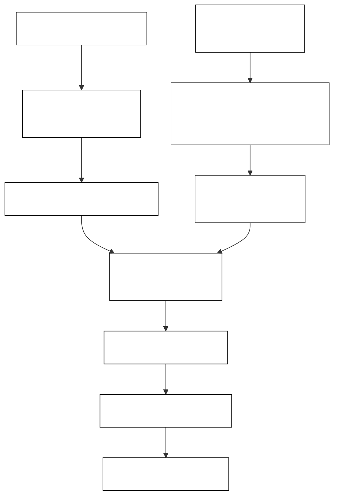

# Few-Shot Chip-Based Visual Search & Detection for Satellite Imagery

A cutting-edge few-shot learning system for satellite imagery analysis that combines **ResNet-50 feature extraction**, **vector matching**, and **OpenCV preprocessing** to detect multiple objects with minimal training examples.

## 🚀 Core Innovation: Few-Shot Learning via Feature Matching

This system implements a **metric-based few-shot learning approach** that enables object detection with only 1-5 reference images per class. Unlike traditional deep learning methods that require thousands of labeled examples, our system:

1. **Leverages Pre-trained Representations**: Uses ResNet-50 as a feature extractor, capitalizing on knowledge learned from ImageNet
2. **Creates Class Prototypes**: Generates representative feature vectors by averaging embeddings from just a few reference "chip" images
3. **Performs Feature Matching**: Compares embeddings from target image windows to class prototypes using cosine similarity
4. **Implements Metric Learning**: Learns a similarity metric in embedding space rather than raw pixel space

### 🛠️ Key Features
Few-Shot Object Detection: Detect objects with only 1-5 reference images per class
Multi-Scale Search: Comprehensive search across 10 different scales (0.4× to 2.4×)
Advanced Preprocessing: LAB color space conversion and CLAHE enhancement
Feature Vector Matching: Cosine similarity-based detection with custom normalization
Visual Output Generation: Automatic visualization of detection results
Multi-Object Support: Simultaneously detect multiple object classes
Non-Maximum Suppression: Eliminate duplicate detections with improved IoU threshold
CSV Export: Structured output of all detections with similarity scores

### Technical Architecture
(Visible in Dark Theme, coz mermaid doesn't support color switching)

